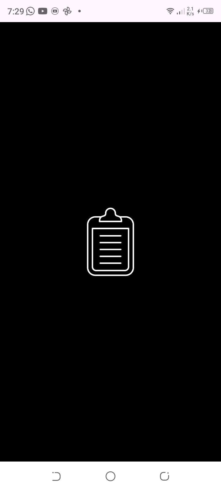
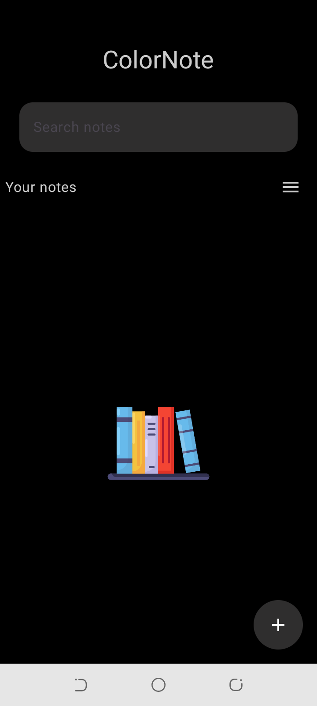
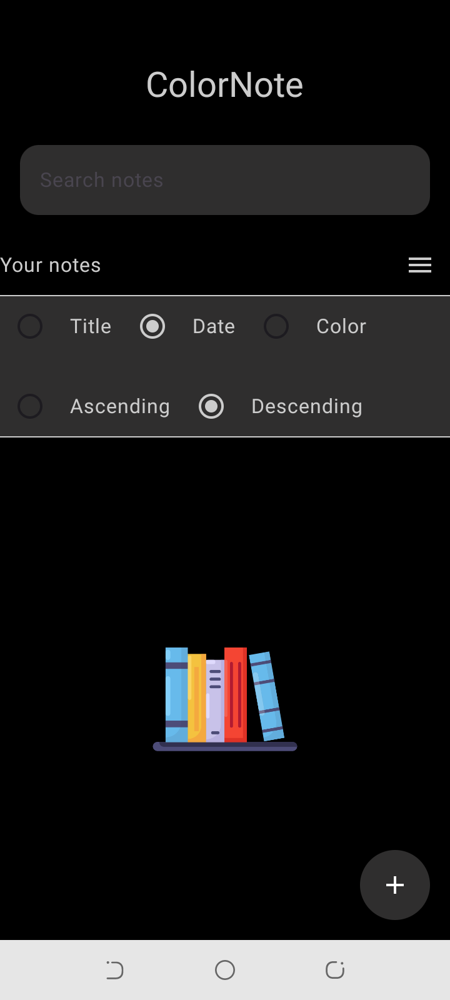
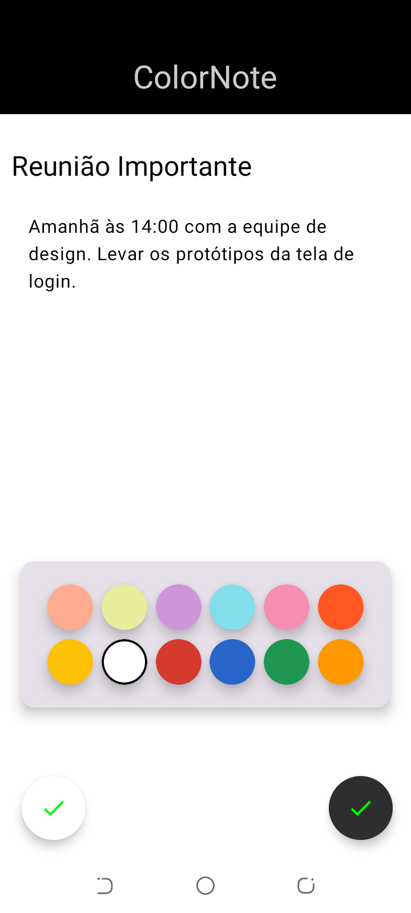
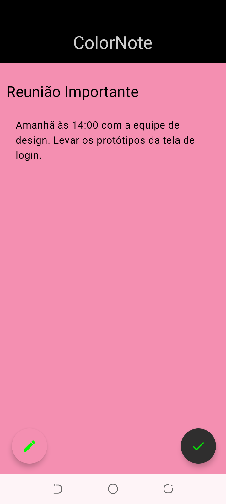
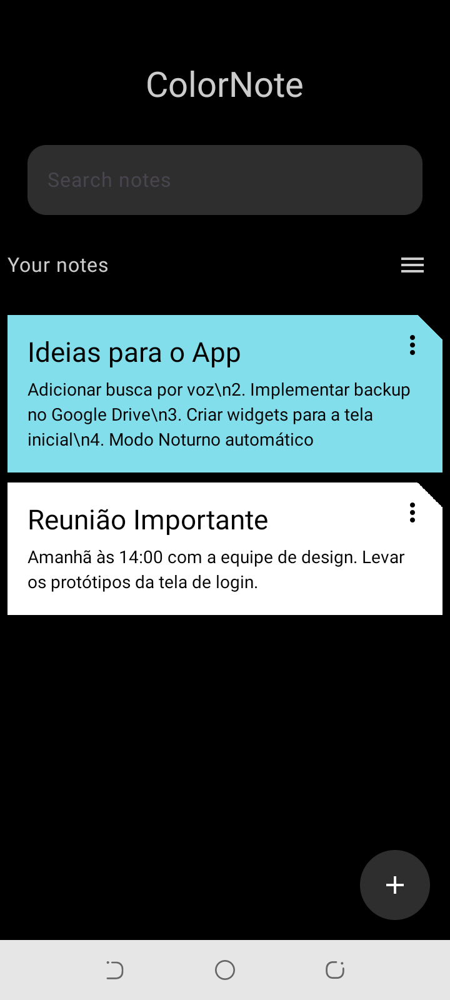
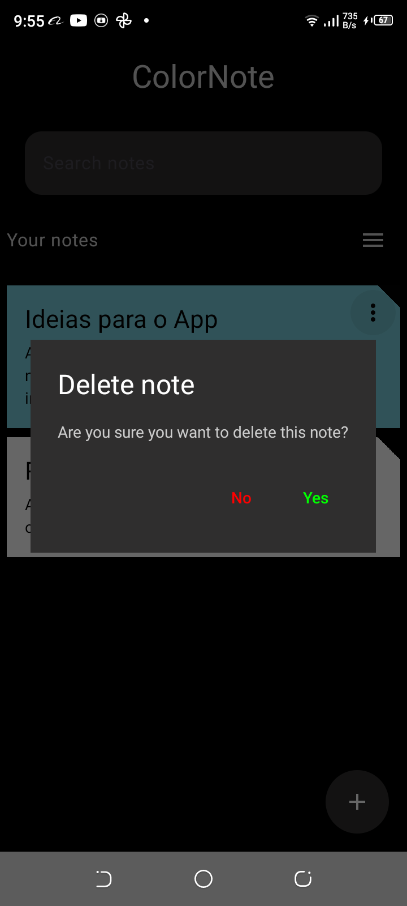

# 📚 ColorNote

- A simple Android note-taking application where users can create notes and organize them using different colors.

- The goal of this project was to practice Jetpack Compose, state management, and local data persistence while building a clean and simple user interface.

---

## ✨ Features

- Create notes
- Assign colors to notes
- Update existing notes
- Delete notes
- Real-time note listing
- Modern UI built with Material Design
- Search notes using a search bar
- Sort notes by:
  - Title
  - Date
  - Color
- Sort notes in ascending or descending order

---

## 🛠 🛠 Tech Stack

- Kotlin
- Jetpack Compose
- MVVM
- Navigation Compose
- Material 3
- Room 
- Material

---

## 📸 Capturas de Tela

  
  
  

  
  

  

---

## 📚 Lessons Learned

- Building modern Android UIs with Jetpack Compose
- Managing UI state in Compose
- Local data persistence using Room
- Structuring an Android project
- Navigation between screens

---

## 🚀 Future Improvements

- Search notes functionality
- Sorting notes by color or date
- Cloud backup
- Note export feature
- UI/UX improvements
- Reminder notifications
---

## 🤝 Contribution
Contributions are welcome. 
 Any developer is free to improve the project as long as the code structure and good development practices are respected.

## 📄 License

This project is open-source and intended for educational and learning purposes.

